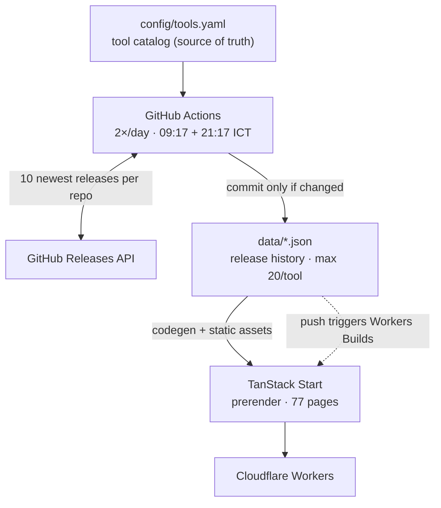

# Release Radar

Personal DevOps/SRE release tracker — a Git-backed catalog that follows new
releases of infrastructure tools on GitHub.



Key property: **no database, no runtime API calls, no client-side tokens**.
The website is a pure function of the committed JSON — if the site shows wrong
data, look at `data/`, not the frontend.

## Why it is this way

- **Data is committed to Git** — history and diffs for free, no rate limits at
  view time, trivially forkable. Modeled after fluxcd/flux-schema.
- **Fully prerendered** — all 77 pages are generated at build time from the
  validated catalog, so the prerendered set and the 404-free set are the same
  set by construction.
- **The catalog index is code-generated, release notes are static assets.**
  The index is ~8.5 KB gzipped and ships to the worker; the 1.9 MB of release
  notes never enter the bundle and are fetched from the asset CDN instead.
  `pnpm check:bundle` fails the build if that ever regresses.
- **`generatedAt` only advances when content changes** — otherwise every
  scheduled run would create a noise commit. Idempotency is tested and
  load-bearing.
- **One deploy path**: Cloudflare Workers Builds (Git integration). Do NOT add
  a deploy step to GitHub Actions — you'd get double deploys.

## Commands

| Command | Purpose |
|---|---|
| `pnpm dev` | Vite dev server |
| `pnpm validate:catalog` | Validate `config/tools.yaml` + regenerate JSON schema |
| `pnpm sync` | Fetch releases from GitHub (needs `GITHUB_TOKEN`) |
| `pnpm test` | Vitest: unit + dom + worker projects (189 tests) |
| `pnpm lint` / `pnpm typecheck` | ESLint / tsc |
| `pnpm build` | Production build + prerender (77 pages) |
| `pnpm audit:markdown` | Inventory the release-note corpus; `--check` gates it |
| `pnpm check:bundle` | Prove release notes stay out of the worker |
| `pnpm preview` | Build + serve on workerd (Cloudflare runtime) locally |
| `pnpm run deploy` | Build + `wrangler deploy` manually |

Node ≥ 26 runs the `.ts` scripts natively — no tsx/ts-node needed. CI and
`@types/node` track the same major on purpose: types ahead of the runtime
would typecheck against APIs that aren't there at run time.

## Code map

| Path | What it is |
|---|---|
| `config/tools.yaml` | Source of truth: the tracked tools. Edit this to add/remove tools. |
| `src/domain/types.ts` | Zod schemas for everything. Types flow from here. |
| `src/domain/releases.ts` | The correctness core: filter → merge/dedupe → cap 20 → stable serialize. Pure, fully unit-tested. |
| `src/server/catalog.ts` | YAML loading + validation. |
| `src/server/release-notes.ts` | `fs` readers — **scripts and tests only**. Prerender runs in workerd, where `node:fs` does not work. |
| `src/data/` | Isomorphic accessors: bundled catalog index, asset-fetched notes. |
| `src/lib/note-links.ts` | The release-note link/image policy — the actual security boundary. |
| `scripts/sync-releases.ts` | Octokit orchestration. Per-tool try/catch: one flaky repo never blocks the rest or wipes existing data. |
| `scripts/validate-catalog.ts` | CLI validation + regenerates `schemas/tool.schema.json` (editor autocomplete for the YAML). |
| `data/` | **Generated.** Never edit by hand; the sync overwrites it. |
| `src/routes/`, `src/components/`, `src/features/` | UI. `features/catalog/home-explorer.tsx` drives search/filter/favorites. |
| `.github/workflows/sync-releases.yaml` | Twice-daily sync, `contents: write`, commits only if `data/` changed. |
| `.github/workflows/ci.yaml` | PR/push checks, `contents: read`, ignores data-only pushes. |
| `.github/workflows/add-tool.yaml` | Add a tool from the Actions UI — fills the catalog, syncs data, opens a PR. |
| `.github/dependabot.yml` | Weekly dependency updates: npm (minor/patch grouped) + github-actions. |
| `scripts/add-tool.ts` + `lib/catalog-edit.ts` | Catalog intake: normalize repo input, auto-fill metadata, append YAML preserving format. |
| `vite.config.ts` + `wrangler.jsonc` | Build and Cloudflare config. |

## Adding a tool (the 90% task)

**From the GitHub UI (no local setup):** Actions → **Add tool** → Run
workflow → fill in the repository (owner/repo or URL), category and optional
fields → a PR appears with the catalog entry plus synced release data —
review and squash-merge it. The workflow runs the full check suite (validate,
test, lint, typecheck, build) before opening the PR; note the bot PR itself
does not trigger the CI workflow (`GITHUB_TOKEN` limitation), the in-run
checks stand in for it. Requires the repo setting *Actions → General →
Workflow permissions → "Allow GitHub Actions to create and approve pull
requests"*.

**Manually:**

1. Add an entry to `config/tools.yaml` (copy an existing one; the JSON schema
   gives autocomplete):

   ```yaml
   - id: my-tool
     name: My Tool
     category: observability   # platform | provisioning | delivery | observability | networking | security | data
     repository: owner/repo
     description: One-line description
     homepage: https://example.com
     tags: [metrics]
     release:
       strategy: github-releases   # github-releases | github-tags | manual
       includePrerelease: false
       tagPattern: "^v\\d+\\.\\d+\\.\\d+$"
   ```

2. `pnpm validate:catalog` → `GITHUB_TOKEN=$(gh auth token) pnpm sync`.
3. Commit both the YAML and the generated `data/` files. Push — Cloudflare
   rebuilds automatically; the scheduled workflow keeps it updated afterwards.

Tag-pattern tips: most tools want `^v\d+\.\d+\.\d+$`. Grafana needs
`(\+security-\d+)?` appended. OTel Collector releases from the `-releases`
repo.

## Sync behavior

- Fetches the ~10 latest releases per repo (never `/releases/latest`, which
  skips prereleases and sorts by `created_at`).
- Filters drafts, prereleases (unless enabled), and tags not matching
  `tagPattern` / matching `ignorePattern` — including retroactively on stored
  history when the config changes.
- Merges by GitHub release id (no duplicates), keeps the 20 newest.
- Deterministic output: unchanged tools are never rewritten, so no-op runs
  produce no commit.

## Gotchas (already bitten once — don't rediscover)

1. **Prerender runs in workerd, not Node.** `node:fs` fails there with
   `[unenv] fs.readFileSync is not implemented yet!`. There is no render context
   where filesystem access works — that is why release notes are static assets.
2. **`prerender.autoSubfolderIndex` must stay `false`.** The default `true`
   emits `foo/index.html`, so Workers Assets serves `/foo` as a 307 to `/foo/` —
   a redirect hop on 76 of 77 URLs, and every canonical URL changes.
3. **`throw notFound()` alone gives a real 404** and server-renders the 404 body.
   Never set `assets.not_found_handling: "single-page-application"` — it returns
   200 for unknown paths.
4. **Start's import-protection fails the build** if route code imports
   `@tanstack/react-start/server`, even behind `await import()` inside an SSR
   branch. Use `createServerOnlyFn` or `createIsomorphicFn().server()`.
5. **pnpm `allowBuilds` is a map, not a list.** A YAML sequence is silently
   ignored and postinstall scripts stay blocked.
6. **Node 26 ships a disabled `localStorage` global** that shadows jsdom's, so
   DOM tests need the polyfill in `tests/dom/setup.ts`.
7. **Hydration and time**: anything time-relative must be deterministic on the
   server. `TimeAgo` renders the absolute date until hydrated; recency buckets
   use `generatedAt` as the server clock. Don't call `Date.now()` in render.
8. **Sync commits don't trigger CI** (GITHUB_TOKEN loop prevention) but DO
   trigger Cloudflare rebuilds. Intentional.
9. **Release notes are hostile input** — render only through
   `components/releases/release-notes.tsx`.

## Deployment

Cloudflare Workers, connected through Workers Builds (Git integration):

- **Build command**: `pnpm build`
- **Deploy command**: `pnpm exec wrangler deploy`
- **Non-production branch deploy command**: `pnpm exec wrangler versions upload`
  (uploads a preview version without promoting it to production)
- **Env**: `CLOUDFLARE_INCLUDE_PROCESS_ENV=true` (prerender runs at build time)

The `pnpm exec` prefix is required: wrangler is a devDependency in
`node_modules/.bin`, and the deploy step runs in a plain `/bin/sh` that does not
have it on PATH. Without it the build succeeds and the deploy fails with
`wrangler: not found`.

These live in the Cloudflare dashboard, not in this repo.

Every push to `main` — including the scheduled data commit — triggers a rebuild.

## UI conventions

"Compact Technical UI": dense, sharp, information-first. Eight named type tiers
(11/12/13/14/15/16/22/24px) chosen by role rather than by eye, control heights of
28/32/36, three radii, and borders rather than shadows for elevation. See
`CLAUDE.md` for the rules and `artifacts/e2e/README.md` for the measured
result.

## Verification standard

Before merging (CI runs the same):

```bash
pnpm validate:catalog && pnpm lint && pnpm typecheck && pnpm test \
  && pnpm audit:markdown --check && pnpm build && pnpm check:bundle
```

For UI changes also run `pnpm preview` and audit with `agent-browser` — `vite
dev` behaviour is not proof, the workerd path is what ships. Current measured
baseline: zero console errors, zero axe violations on every route type, grid
4/2/1 at 1440/768/390, LCP 52–60ms, CLS 0.000. See `artifacts/e2e/README.md`.

**Release notes render through `@tanstack/markdown` with `allowHtml: false`.**
It has no autolink literals, so bare URLs in notes render as plain text — an
accepted regression affecting 221 of 597 notes across 40 tools, measured in
`artifacts/markdown/corpus-report.md`.

## Deferred by design (don't build yet)

Phase 2+: RSS, Slack/Telegram digest, major/minor/patch classification, CVE &
EOL tracking, installed-version comparison.
