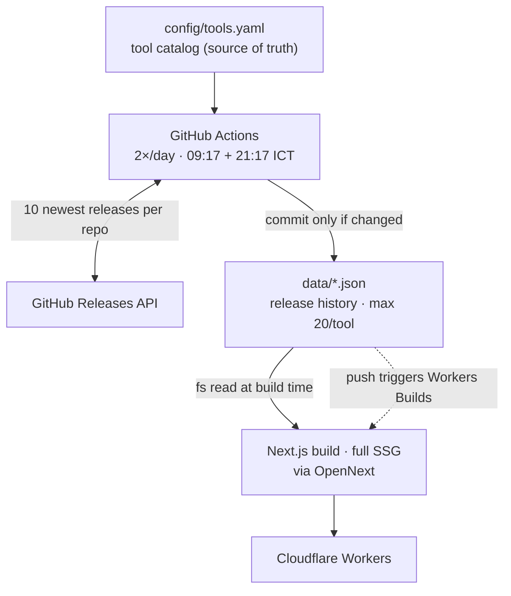

# Release Radar

Personal DevOps/SRE release tracker — a Git-backed catalog that follows new
releases of infrastructure tools on GitHub.



Key property: **no database, no runtime API calls, no client-side tokens**.
The website is a pure function of the committed JSON — if the site shows wrong
data, look at `data/`, not the frontend.

## Why it is this way

- **Data is committed to Git** — history and diffs for free, no rate limits at
  view time, trivially forkable. Modeled after fluxcd/flux-schema.
- **Full SSG, no ISR/SSR** — every route exports `dynamic = "error"` so the
  build fails loudly if a route accidentally becomes dynamic.
- **JSON is read with `fs` at build time** (`lib/data.ts`), never `import`ed —
  importing would bundle every release note into the worker and blow the
  3 MiB gzip limit.
- **`generatedAt` only advances when content changes** — otherwise every
  scheduled run would create a noise commit. Idempotency is tested and
  load-bearing.
- **One deploy path**: Cloudflare Workers Builds (Git integration). Do NOT add
  a deploy step to GitHub Actions — you'd get double deploys.

## Commands

| Command | Purpose |
|---|---|
| `pnpm dev` | Next.js dev server |
| `pnpm validate:catalog` | Validate `config/tools.yaml` + regenerate JSON schema |
| `pnpm sync` | Fetch releases from GitHub (needs `GITHUB_TOKEN`) |
| `pnpm test` | Vitest unit tests (catalog, sync logic, sanitization) |
| `pnpm lint` / `pnpm typecheck` | ESLint / tsc |
| `pnpm build` | Next.js production build (all routes static) |
| `pnpm preview` | Build + serve on workerd (Cloudflare runtime) locally |
| `pnpm run deploy` | Build + deploy to Cloudflare Workers manually |

Node ≥ 26 runs the `.ts` scripts natively — no tsx/ts-node needed. CI and
`@types/node` track the same major on purpose: types ahead of the runtime
would typecheck against APIs that aren't there at run time.

## Code map

| Path | What it is |
|---|---|
| `config/tools.yaml` | Source of truth: the tracked tools. Edit this to add/remove tools. |
| `lib/types.ts` | Zod schemas for everything (catalog, release, index). Types flow from here. |
| `lib/releases.ts` | The correctness core: filter → merge/dedupe → cap 20 → stable serialize. Pure functions, fully unit-tested. |
| `lib/catalog.ts` | YAML loading + validation. |
| `lib/data.ts` | Build-time `fs` readers for pages. |
| `scripts/sync-releases.ts` | Octokit orchestration. Per-tool try/catch: one flaky repo never blocks the rest or wipes existing data. |
| `scripts/validate-catalog.ts` | CLI validation + regenerates `schemas/tool.schema.json` (editor autocomplete for the YAML). |
| `data/` | **Generated.** Never edit by hand; the sync overwrites it. |
| `app/`, `components/` | Next.js UI. `home-explorer.tsx` is the main client component (search/filter/favorites). |
| `.github/workflows/sync-releases.yaml` | Twice-daily sync, `contents: write`, commits only if `data/` changed. |
| `.github/workflows/ci.yaml` | PR/push checks, `contents: read`, ignores data-only pushes. |
| `.github/workflows/add-tool.yaml` | Add a tool from the Actions UI — fills the catalog, syncs data, opens a PR. |
| `.github/dependabot.yml` | Weekly dependency updates: npm (minor/patch grouped) + github-actions. |
| `scripts/add-tool.ts` + `lib/catalog-edit.ts` | Catalog intake: normalize repo input, auto-fill metadata, append YAML preserving format. |
| `open-next.config.ts` + `wrangler.jsonc` | Cloudflare adapter config. |

## Adding a tool (the 90% task)

**From the GitHub UI (no local setup):** Actions → **Add tool** → Run
workflow → fill in the repository (owner/repo or URL), category and optional
fields → a PR appears with the catalog entry plus synced release data —
review and squash-merge it. The workflow runs the full check suite (validate,
test, lint, typecheck, build) before opening the PR; note the bot PR itself
does not trigger the CI workflow (`GITHUB_TOKEN` limitation), the in-run
checks stand in for it. Requires the repo setting *Actions → General →
Workflow permissions → "Allow GitHub Actions to create and approve pull
requests"*.

**Manually:**

1. Add an entry to `config/tools.yaml` (copy an existing one; the JSON schema
   gives autocomplete):

   ```yaml
   - id: my-tool
     name: My Tool
     category: observability   # platform | provisioning | delivery | observability | networking | security | data
     repository: owner/repo
     description: One-line description
     homepage: https://example.com
     tags: [metrics]
     release:
       strategy: github-releases   # github-releases | github-tags | manual
       includePrerelease: false
       tagPattern: "^v\\d+\\.\\d+\\.\\d+$"
   ```

2. `pnpm validate:catalog` → `GITHUB_TOKEN=$(gh auth token) pnpm sync`.
3. Commit both the YAML and the generated `data/` files. Push — Cloudflare
   rebuilds automatically; the scheduled workflow keeps it updated afterwards.

Tag-pattern tips: most tools want `^v\d+\.\d+\.\d+$`. Grafana needs
`(\+security-\d+)?` appended. OTel Collector releases from the `-releases`
repo.

## Sync behavior

- Fetches the ~10 latest releases per repo (never `/releases/latest`, which
  skips prereleases and sorts by `created_at`).
- Filters drafts, prereleases (unless enabled), and tags not matching
  `tagPattern` / matching `ignorePattern` — including retroactively on stored
  history when the config changes.
- Merges by GitHub release id (no duplicates), keeps the 20 newest.
- Deterministic output: unchanged tools are never rewritten, so no-op runs
  produce no commit.

## Gotchas (already bitten once — don't rediscover)

1. **`defineCloudflareConfig()` alone breaks SSG pages** (500/404 on workerd).
   `incrementalCache: staticAssetsIncrementalCache` in `open-next.config.ts`
   is required — don't remove it.
2. **pnpm 10+ blocks postinstall scripts** (`ERR_PNPM_IGNORED_BUILDS`). The
   allowlist lives in `pnpm-workspace.yaml` (`allowBuilds`).
3. **Hydration and time**: anything time-relative rendered on the server must
   be deterministic. `TimeAgo` renders the absolute date until hydrated; the
   home page buckets use `generatedAt` as the server clock via
   `useSyncExternalStore`. Don't call `Date.now()` in render paths.
4. **Sync commits don't trigger CI** (GITHUB_TOKEN loop prevention) but DO
   trigger Cloudflare rebuilds (external GitHub App). This is intentional.
5. **Edge runtime is not supported** by the OpenNext adapter. Never add
   `export const runtime = "edge"`.
6. **Release notes are hostile input** — always render them through
   `components/release-notes.tsx` (rehype-sanitize), never any other way.

## Deployment

Cloudflare Workers via OpenNext, connected through Workers Builds (Git
integration):

- **Build command**: `pnpm exec opennextjs-cloudflare build`
- **Deploy command**: `npx opennextjs-cloudflare deploy`

Every push to `main` — including the scheduled data commit — triggers a rebuild.

## Verification standard

Before merging: `pnpm test && pnpm lint && pnpm typecheck && pnpm build`
(CI runs the same). For UI changes, also `pnpm preview` and check the pages on
workerd — `next dev` behavior is not proof, the SSG/worker path is what ships.
Current browser-tested baseline: zero console errors, zero axe-core violations.

## Deferred by design (don't build yet)

Phase 2+: RSS, Slack/Telegram digest, major/minor/patch classification, CVE &
EOL tracking, installed-version comparison.
